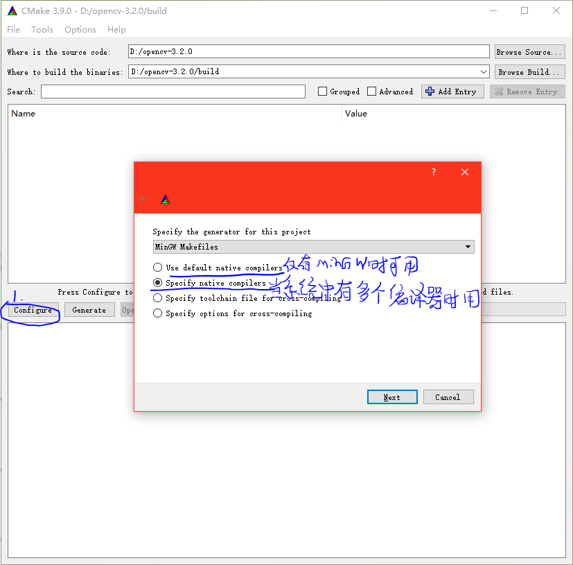
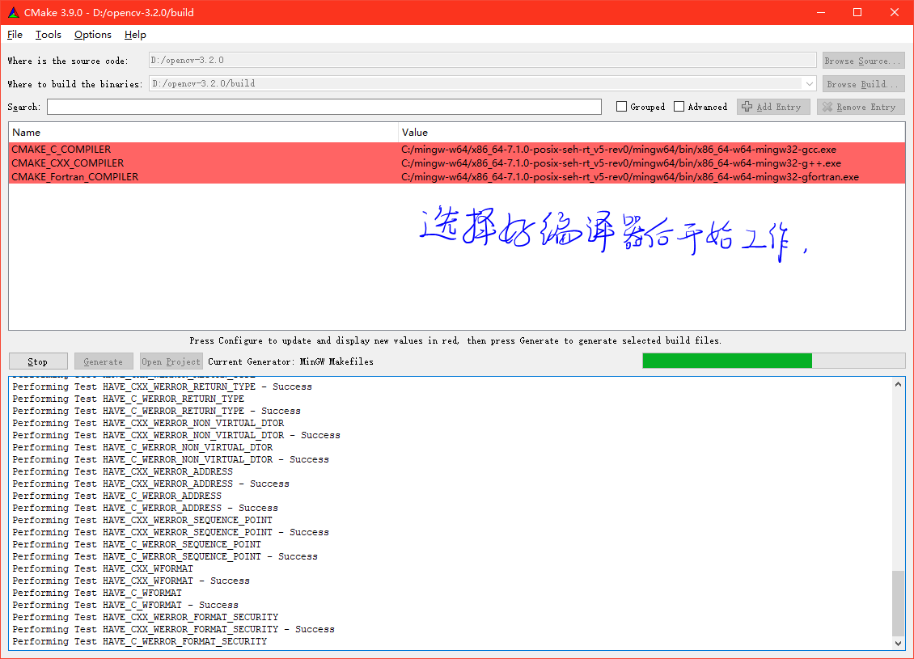
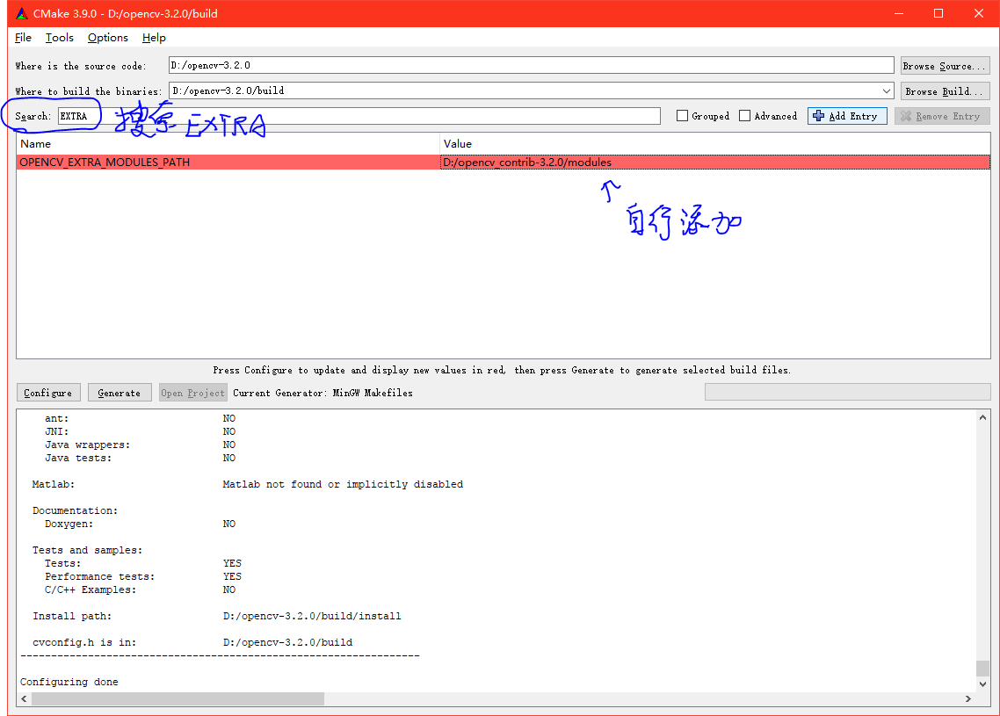
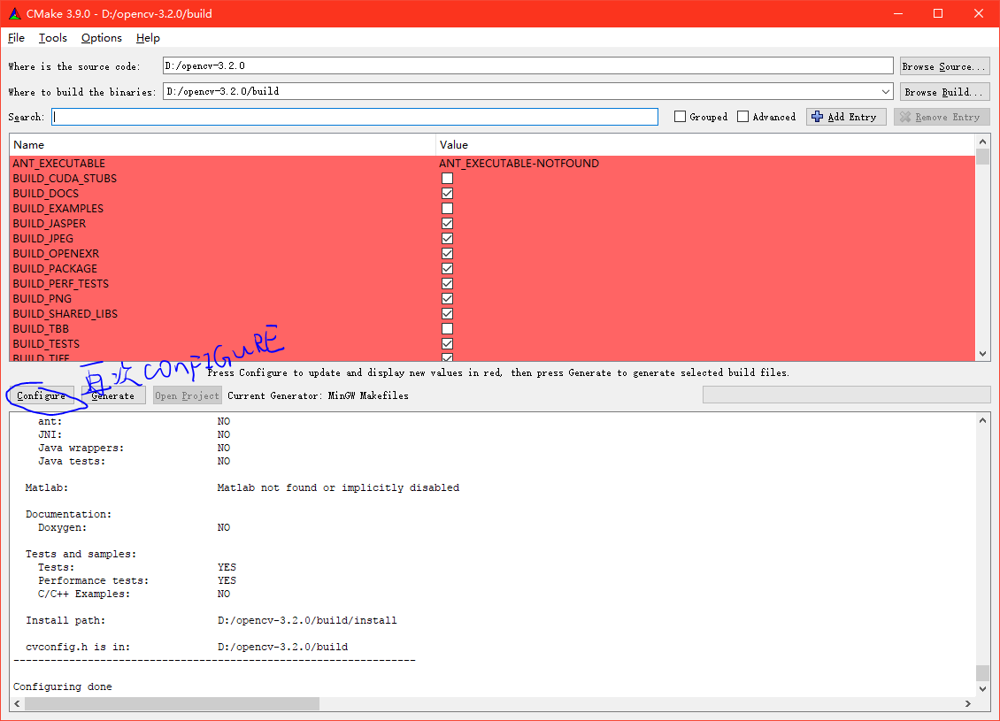
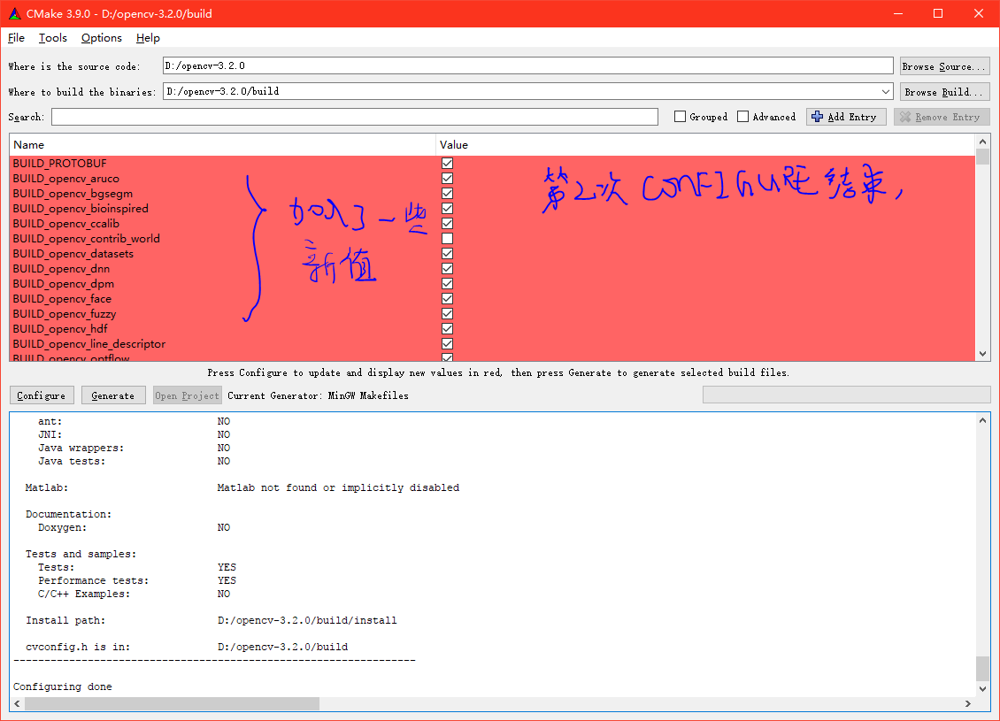
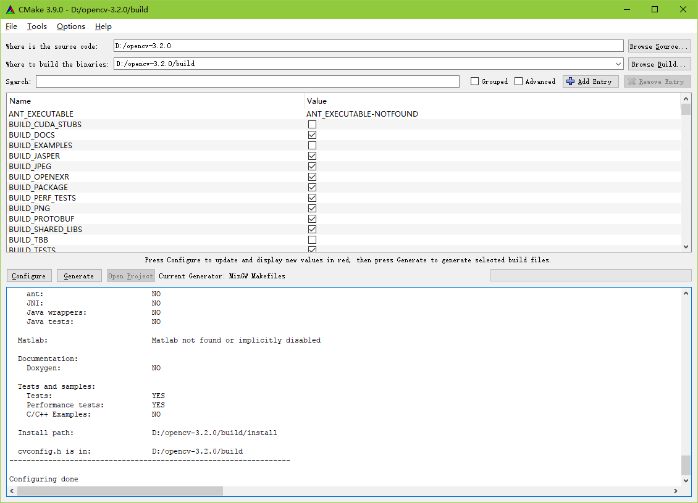
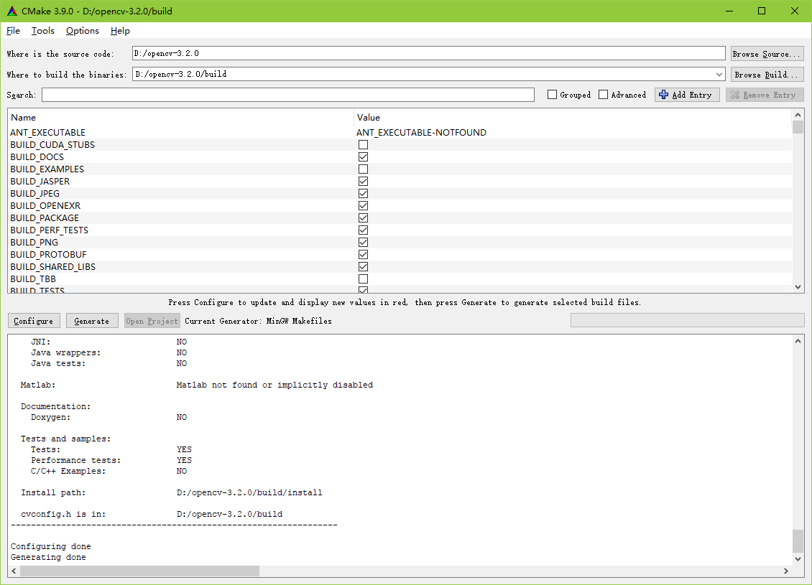
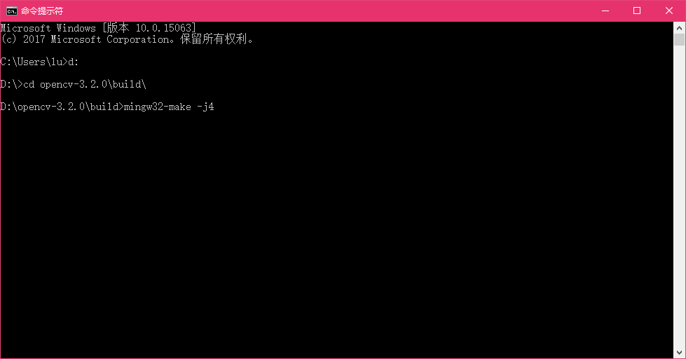
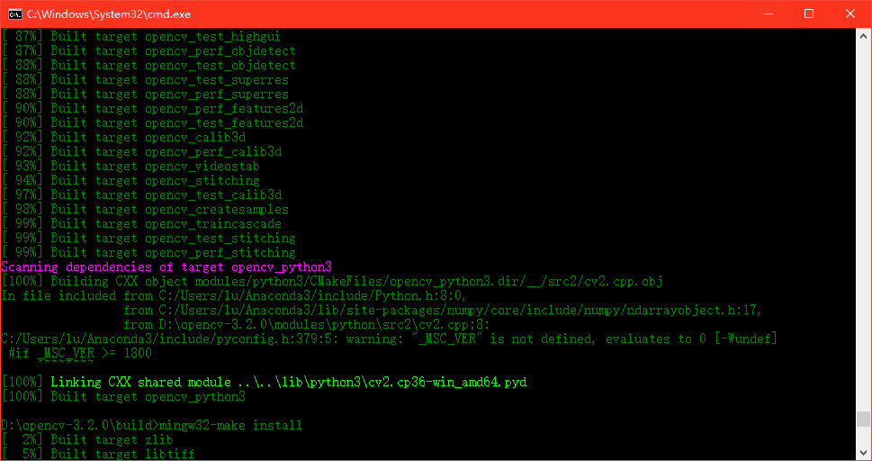
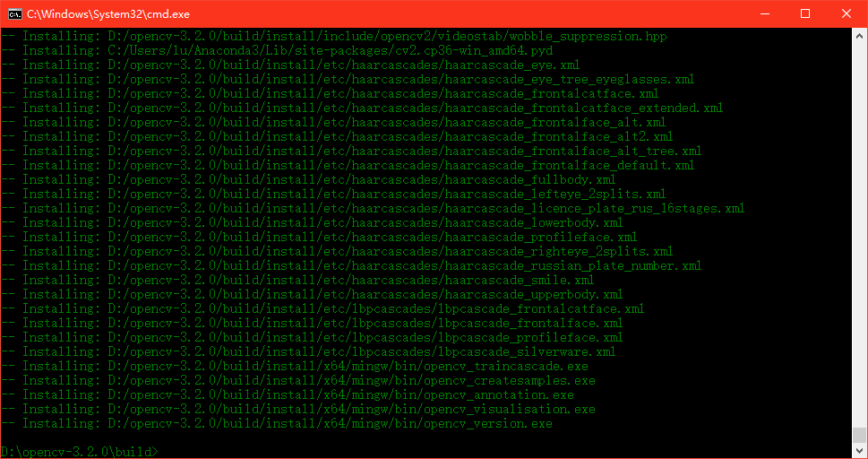

# 在Windows下安装OpenCV

> opencv.org提供了Windows的安装包，其中包含了为 Visual Studio 编译好的库，网上导入工程的教程很多，这里只讲用CMake-GUI 调用 MinGW/Cygwin 进行编译

> Windows下的安装和Linux类似  
只是把 CMake 的命令改为 GUI下进行：

### 1. 下载必备软件
* 下载 [OpenCV](http://www.opencv.org/releases.html) [CMake](https://cmake.org/download/)  [MinGW](https://sourceforge.net/projects/mingw-w64/) //安装时可能需要科学上网  
* 将 mingw的bin加入环境变量

### 2. 用CMake生成makefile  

*假设现在源码放在 D:\opencv-3.2.0\ 其他模块放在 D:\opencv_contrib-3.2.0\ 下*

* 打开CMake,选择源码位置，与在linux上安装类似,如图:  

* 第一次Configure:  

* 第二次Configure(添加opencv_contrib附加库)(Optional):  

* 第三次Configure:  

* 最后Generate(保证Generate时没有红底项):  

>  同样的 由于各种原因会在 Downloading opencv_ffmpeg.dll... 或者 protobuf-cpp-3.1.0.tar.gz 上卡住，解决方案见linux.md ，不再赘述

> 注意：使用MinGW编译时千万不要添加Intel IPP库 [原因不明](https://github.com/opencv/opencv/issues/4778)

### 3.编译链接和安装(同linux安装)

* 打开cmd:  

* 编译完成:  

* 生成二进制文件:  

> 注意：用MinGW64在编译Python库的最后出现问题   
通过注释掉 Anaconda3/include/pyconfig.h的241行   
即通过编译  
当前所用环境 Anaconda 1.5(Python3.6) + CMake 3.9.0 + mingw-w64(x86_64-7.1.0-posix-seh-rt_v5-rev0)
